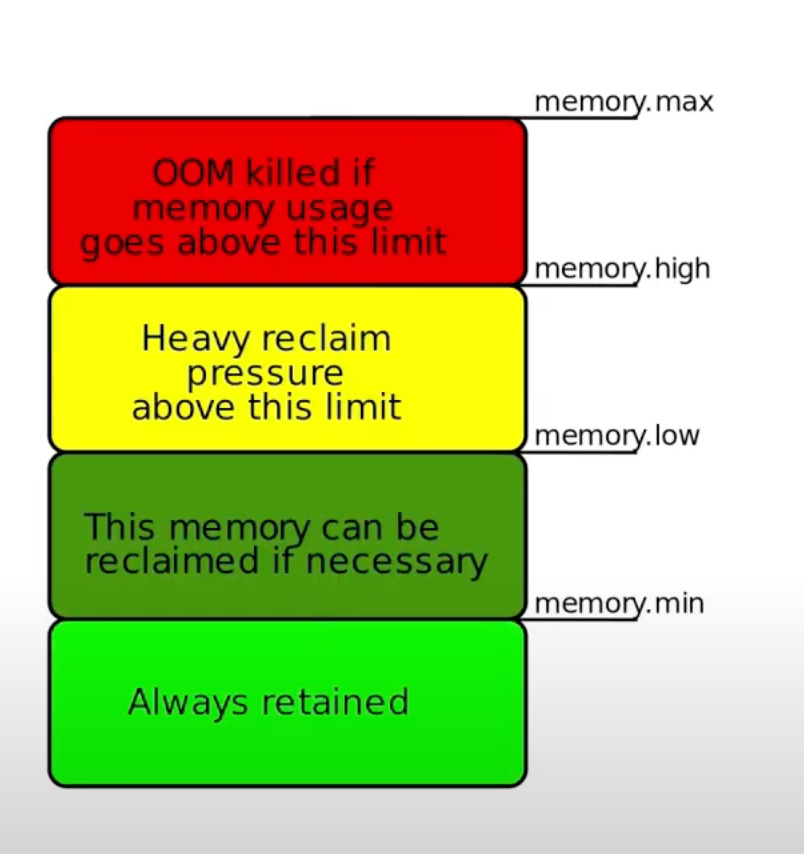

# cgroups v2 introduction journey

This is a hands on guide that I put together to help others understand cgroups. It is the first of a series I am planning on how containers work at low level.

It is designed to be easy to follow along by running the commands in order and providing explanations as you interact with cgroups in your system. If there is anything here you think it's missing feel free to let me know, or contribute to the repository.

> Please be careful where you run these commands as they affect your kernel configuration. Even though none of the commands will destroy your system, It stands to reason you shouldn't run these on production or directly in the host OS you use for work, run them instead on a VM. To write this guide I have used [OrbStack](https://orbstack.dev/) on MacOS as it's great for running low footprint VMs where you can quickly test things out, but any other VM running Linux should work.

## Why cgroups? 

Broadly speaking containers are made up of the following: 

* cgroups: How much resources container is entitled to
* namespaces: What resources container can access
* chroot: what files a container can access 

cgroups control the amount of resources that processes are entitled to. In the context of containers they are very important to ensure that no single container hogs all of the resources of a system, leaving nothing for others.

In this section we will cover exclusively cgroups.

## cgroups v1

I am not covering cgroups v1 in this guide. To determine what cgroups version your system is using run the following command:

```bash
stat -fc %T /sys/fs/cgroup/
```

The output should be:
```output
cgroup2fs
```

If you want to know the differences between v1 and v2 read [here](https://git.kernel.org/pub/scm/linux/kernel/git/tj/cgroup.git/tree/Documentation/admin-guide/cgroup-v2.rst#:~:text=using%20bio_associate_blkg()%0Adirectly.-,Deprecated%20v1%20Core%20Features,-%3D%3D%3D%3D%3D%3D%3D%3D%3D%3D%3D%3D%3D%3D%3D%3D%3D%3D%3D%3D%3D%3D%3D%3D%3D%3D%3D%0A%0A%2D%20Multiple) or watch this [talk](https://youtu.be/ikZ8_mRotT4). [Here](https://youtu.be/u8h0e84HxcE?t=760) are a list of issues with cgroup v1 that cgroup v2 solves.


## 0. Exploring the cgroups v2 filesystem

Let's begin our journey by learning how the cgroups filesystem is organized, if you run the following command:

```bash
ls /sys/fs/cgroup/
```

You should get an output like this:

```output
cgroup.controllers      cpu.max.burst                    io.max               memory.swap.current
cgroup.events           cpuset.cpus                      io.stat              memory.swap.events
cgroup.freeze           cpuset.cpus.effective            memory.current       memory.swap.high
cgroup.kill             cpuset.cpus.exclusive            memory.events        memory.swap.max
cgroup.max.depth        cpuset.cpus.exclusive.effective  memory.events.local  memory.swap.peak
cgroup.max.descendants  cpuset.cpus.partition            memory.high          pids.current
cgroup.procs            cpuset.mems                      memory.low           pids.events
cgroup.stat             cpuset.mems.effective            memory.max           pids.max
cgroup.subtree_control  cpu.stat                         memory.min           pids.peak
cgroup.threads          cpu.stat.local                   memory.oom.group     system.slice
cgroup.type             cpu.weight                       memory.peak          user.slice
cpu.idle                cpu.weight.nice                  memory.reclaim
cpu.max                 init.scope                       memory.stat
```

The directory `/sys/fs/cgroup` represents the root cgroup in your system, directories and subdirectories created will share resources.

I am not going to go into detail describing all these files, that's what the [man page](https://git.kernel.org/pub/scm/linux/kernel/git/tj/cgroup.git/tree/Documentation/admin-guide/cgroup-v2.rst) is for, but I will give an overview of their type so we can understand their classification.

> The directories here represent child cgroups. The ones present now `init.scope`, `user.slice` and `system.slice`. I won't talk about them here but if you are curious you can learn more [here](https://medium.com/@charles.vissol/systemd-and-cgroup-7eb80a08234d). 


### Types of files in the cgroups filesystem
cgroups are composed of **core** and **controllers**.

1. **Controllers**: as the name implies, they control a type of system resource within the cgroup and its hierarchy. Controller files in the cgroup filesystem are prefixed by the controller name such as `memory.` or `cpu.`
2. **Core**: primarily responsible for hierarchically organizing processes. Core files are prefixed by `cgroup.`


### Status (read-only) vs configuration (read-write) files
 
#### Read-only files

Some of the files in the cgroup filesystem are read-only and dynamically show the status or configuration of the cgroup or controller. For example:

`cat /sys/fs/cgroup/cgroup.controllers` --> Shows a space separated list of all controllers available to the cgroup.

`watch cat /sys/fs/cgroup/memory.stat` --> If you watch the output of this file you will see it change slightly every two seconds, giving the status of the cgroup memory footprint

#### Read-write files

You can directly write to these files to change the configuration of the cgroup. For example:

`echo $$ > /sys/fs/cgroup/cgroups.procs` --> Adds your current shell process to the root cgroup.

`echo "max" > /sys/fs/cgroup/containers/pids.max` --> Sets the number of pids to the maximum allowed.

### File prefixes and their meaning

Except for the `cgroup` prefix which controls core configuration and status of the cgroup, all other files are to configure and view status of controllers.

* `cpu`: regulates the distribution of CPU cycles. For example setting `cpu.max` will limit the amount of cpu a process can use whereas `cpu.stat` reports the status of the cpu ans so on.

* `memory`: regulates the distribution of memory. For example `memory.max` will try and keep the memory of a process within that limit and `memory.min` will ensure a process always has that amount of memory available to it. It's worth noting that unlike cpu which will constrain a process on that limit, memory can only throttle it for so long until it is killed if it goes over its limits. If you really want to ensure that a process does not "cheat" its way into an inordinate amount of memory by paging, you will want to also implement `memory.swap.max`

* `io`: regulates the distribution of io resources, in other words, access to disk (hdd, ssd, etc)

* `pids`: It regulates the number of processes. For example `pids.max` sets a hard limit in the number of processes whereas `pids.current` returns the number of processes currently running in the cgroup and its descendants.

* `cpuset`: The "cpuset" controller restricts tasks to specific CPUs and memory nodes, optimizing performance by minimizing memory access latency and contention, particularly useful on large systems with Non-Uniform Memory Access (NUMA) architecture.

* `cgroup`: Not a controller. `cgroup.` files provide configuration for the core.


## 1. Creating our cgroups hierarchy

> Many of the commands going forward will not work unless you are root, you can either prefix them with `sudo` or switch to root now by doing `sudo su`

Before we move onwards, export these variables, you can change the values to whatever you want:

```bash
export PARENT_CGROUP=containers
export CHILD_CGROUP=goofytimes
```

Also, you may need to install `cgtools` in your system, you can do so with the following command in Debian based systems:

```bash
apt -y install cgroup-tools
```

Now let's create our root cgroup

```bash
cgcreate -g memory,cpu:/${PARENT_CGROUP}
```
If you got no output, then that's probably a good sign, let's check that it was indeed created and what's inside it:

```bash
ls /sys/fs/cgroup/${PARENT_CGROUP}
```
Output:

```
cgroup.controllers      cgroup.subtree_control  cpu.weight           memory.min           memory.swap.max
cgroup.events           cgroup.threads          cpu.weight.nice      memory.oom.group     memory.swap.peak
cgroup.freeze           cgroup.type             memory.current       memory.peak          pids.current
cgroup.kill             cpu.idle                memory.events        memory.reclaim       pids.events
cgroup.max.depth        cpu.max                 memory.events.local  memory.stat          pids.max
cgroup.max.descendants  cpu.max.burst           memory.high          memory.swap.current  pids.peak
cgroup.procs            cpu.stat                memory.low           memory.swap.events
cgroup.stat             cpu.stat.local          memory.max           memory.swap.high
```

You will notice that our cgroup has the `pids` controller enabled, but why? We specifically created a control group with the `cpu` and `memory` controller only. So we shouldn't get the `pids` controller, right?

Let's take a look at the controllers enabled in this directory with the following command:

```bash
cat /sys/fs/cgroup/${PARENT_CGROUP}/cgroup.controllers
```
Which gives the following output:

```output
cpu memory pids
```

So what gives then? Before I explain why, run this command:

```bash
cat /sys/fs/cgroup/cgroup.subtree_control
```
This gives the exact same output as the file `cgroup_controllers` in our new cgroup:

```output
cpu memory pids
```

That means that all children of the root cgroup will have those controllers enabled (but not necessarily its grandchildren), on the other hand, if you look into the file under `$PARENT_CGROUP`

```bash
cat /sys/fs/cgroup/${PARENT_CGROUP}/cgroup.subtree_control
```
It returns nothing, meaning we can change it and add our own `subtree_control` here, but only for the controllers enabled in this cgroup. 

If we run same command from earlier again to create a child for our cgroup named `$CHILD_CGROUP`:

```bash
cgcreate -g memory,cpu:/${PARENT_CGROUP}/${CHILD_CGROUP}
```

And we look again within the `cgroup.subtree_control` under `${PARENT_CGROUP}`, then we see that now the right controllers are added:

```
# cat /sys/fs/cgroup/${PARENT_CGROUP}/cgroup.subtree_control
cpu memory
```

That means that any children under `{$PARENT_CGROUP}` will now have `cpu` and `memory` controllers enabled by default.


> Note that any cgroup that has `subtree_control` enabled cannot have any processes of its own, EXCEPT the root cgroup (`/sys/fs/cgroup`). That means you won't be able to assign any processes to `${PARENT_CGROUP}`, only to `${PARENT_CGROUP}/${CHILD_CGROUP}` or any other directory created under `${PARENT_CGROUP}` that doesn't have `subtree_control` enabled. Read more about it in the man page under [No Internal Process Constraint](https://git.kernel.org/pub/scm/linux/kernel/git/tj/cgroup.git/tree/Documentation/admin-guide/cgroup-v2.rst#:~:text=have%20it%20enabled.-,No%20Internal%20Process%20Constraint,-~~~~~~~~~~~~~~~~~~~~~~~~~~~~~~%0A%0ANon%2Droot)


And if we look at the new cgroup folder for `${CHILD_CGROUP}`:

```
ls /sys/fs/cgroup/${PARENT_CGROUP}/${CHILD_CGROUP}
```

We get the following output:

```output
cgroup.controllers      cgroup.stat             cpu.stat             memory.low        memory.swap.current
cgroup.events           cgroup.subtree_control  cpu.weight           memory.max        memory.swap.events
cgroup.freeze           cgroup.threads          cpu.weight.nice      memory.min        memory.swap.high
cgroup.kill             cgroup.type             memory.current       memory.oom.group  memory.swap.max
cgroup.max.depth        cpu.idle                memory.events        memory.peak       memory.swap.peak
cgroup.max.descendants  cpu.max                 memory.events.local  memory.reclaim
cgroup.procs            cpu.max.burst           memory.high          memory.stat
```

Notice how the `io`, `cpuset` or `pid` controller flags are not there. Exactly what we want.


## 2. Adding controller configuration to our cgroup

In this section we are going to test adding maximum cpu limits and memory limits.

> You can check out [resource distribution models](https://git.kernel.org/pub/scm/linux/kernel/git/tj/cgroup.git/tree/Documentation/admin-guide/cgroup-v2.rst#:~:text=to%20avoid%20them.-,Resource%20Distribution%20Models,-%3D%3D%3D%3D%3D%3D%3D%3D%3D%3D%3D%3D%3D%3D%3D%3D%3D%3D%3D%3D%3D%3D%3D%3D%3D%3D%3D%3D%0A%0Acgroup%20controllers) in the man page for more information about how you can distribute your resource allocation along the cgroup hierarchy.

* `cpu.max`: The processes assigned to this cgroup won't be able to use more CPU than what we assign here, we will assign the limit to `10000`, which equals 10% of CPU.
* `memory.max:`: maximum RAM (around 100MB in bytes), but the process can still use swap!
* `memory.swap.max`: limit the amount of swap the process can use, also 100 MB

> `cpu.max` sets a hard limit to the process, meaning the cpu for the entire cgroup will not go above around 10%, to be shared among all the processes, cpu throttling never kills a process. 

>`memory.max`: if the memory gets above the limit specified here, the kernel will enforce it by throttling the memory usage of the cgroup. Throttling means increasing memory pressure which, leads the kernel to reduce memory allocation requests and aggressively reclaim memory from the cgroup, this involves freeing data from memory that's not needed or swapping it out to disk (depending on swappiness setting). If that fails, it will trigger a OOM kill for the process in the cgroup with the highest OOM score. By setting both `memory.max` and `memory.swap.max` we are essentially forcing an early OOM for the tests we are going to perform ahead in this guide because the kernel will be unable to reclaim a lot of memory into swap. The criteria that determines OOM score and what you can do to protect a process from triggering OOM kill can be found [here](https://man7.org/linux/man-pages/man5/proc.5.html#:~:text=in%0A%20%20%20%20%20%20%20%20%20%20%20%20%20%20Linux%203.7.-,/proc/pid/oom_score,-(since%20Linux%202.6.11)). 


Let's set these three:

```bash
cgset -r memory.max=100000000 ${PARENT_CGROUP}/${CHILD_CGROUP}
cgset -r memory.swap.max=100000000 ${PARENT_CGROUP}/${CHILD_CGROUP}
cgset -r cpu.max="100000 1000000" ${PARENT_CGROUP}/${CHILD_CGROUP}
```

> The values for `memory` are set in bytes here (but could also do `100M` for 100 megs, or `1G` for one 1gig, and so on), for cpu is set to `$MAX $PERIOD`, you can think of it as stating that for every one million microseconds (one second) the cpu can only be used for one hundred thousand microseconds (tenth of a second), so around 10% limit. You can actually adjust this ratio to as low as `"1000 10000"` if you prefer as well for a similar result.

We can double check the values were added with this command:

```bash
cat /sys/fs/cgroup/${PARENT_CGROUP}/${CHILD_CGROUP}/{memory,cpu,memory.swap}.max
```

Which will yield the output:

```output
99999744
100000 1000000
99999744
```

>If you are curious why the memory we the `100000000` of memory we assigned got changed to `99999744` that's because it is being adjusted internally to align with the kernel [page size](https://en.wikipedia.org/wiki/Page_(computer_memory)), running the command `getconf PAGE_SIZE` returns `4096`. If you divide `100000000 / 4096` you get `24414.0625`. So you can effectively use `24414` pages of memory here. So `24414 * 4096` and you get `99999744` - the closest you can get to your original number based on the page size.


## 3. Testing the resource constrains our cgroup

### Stressing the CPU
Let's start first by seeing what happens if we stress the CPU without a process being part of our cgroup:

```bash
yes >/dev/null &
sleep 0.5
ps -p $! -o %cpu
kill $!
```

When you run these commands you are likely going to get a CPU output of nearly 100%. This is because the command `yes` doesn't have a cap on resources: 

```output
%CPU
 98.1
```

Now let's enter a bash terminal that's inside the cgroup we created like so:

```bash
cgexec -g memory,cpu:${PARENT_CGROUP}/${CHILD_CGROUP} bash
```

Run the same command block to test our CPU above and notice the difference:
```output
%CPU
 11.8
```

As you can see, the CPU barely gets above 10%, and if you keep watching the command running with a tool like `htop` you will notice it rarely will go above it.

Let's stay in our cgroup `bash` fork and observe what happens to our process when we fill its memory up.

### Filling up the memory

Let's now run this command within our bash cgrouped process from above:

```bash
echo $(tr -d '\0' < /dev/urandom | head -c200M) > /dev/null &
```

This creates a very large variable of 200 MBs, which overloads the roughly 100 MB limit we imposed earlier. Hence, it will eventually kill the process, but in the meantime we can watch the memory and swap grow on the way to death with the following command:

```bash
watch ps -p $! -o rss,sz
```

The output will look more or less like this:
```output
  RSS    SZ
19432  7056
```

You will eventually see this:

```output
[2]+  Killed                  echo $(tr -d '\0' < /dev/urandom | head -c200M) > /dev/null
```

Once you see the process die, you can exit the bash process that's on the cgroup:

```bash
exit
```

### Can you prevent cgroups from killing processes that use too much memory?

Yes, if you use `memory.high` and `memory.swap.high` instead what will happen in the above scenario is that the process will fill the memory as much as it can and then enter a `D` uninterruptible state until an agent or another process frees memory up. This may be a more desirable scenario for most cases as it acts as a softer limit.

This graph shows the different memory protection levels you can assign to a process within a cgroup:



[Image source](https://youtu.be/u8h0e84HxcE)


## 4. cgroups top (table of processes) and ls (list)

`systemd-cgls` and `systemd-cgtop` are equivalent to `ls` and `top` for cgroups.

### systemd-cgtop

First, it's worth noting that if a cgroup doesn't have any processes assigned to it, it will not show on `systemd-cgtop`, therefore we will run a few commands inside our cgroup to check it out.

```bash
for p in {1..5} ; do cgexec -g memory,cpu:${PARENT_CGROUP}/${CHILD_CGROUP} sleep 2000 & done
cgexec -g memory,cpu:${PARENT_CGROUP}/${CHILD_CGROUP} yes > /dev/null &
```

Now that we have a few processes running:

```bash
systemd-cgtop
```
Yields the following output:

```output
Control Group                                          Tasks   %CPU   Memory  Input/s Output/s
/                                                         78   11.6     1.3G        -        -
/containers                                                6   10.0   680.0K        -        -
/containers/goofytimes                                     -   10.0   680.0K        -        -
/system.slice                                              -      -    41.6M        -        -
```

Notice that the CPU sits just above 10% as we defined earlier

### systemd-cgls
Now let's list all our cgroups and processes inside them:

```bash
systemd-cgls /containers
```

And we get:

```output
Control group /containers:
└─goofytimes (#17303)
  ├─12149 sleep 2000
  ├─12150 sleep 2000
  ├─12151 sleep 2000
  ├─12152 sleep 2000
  ├─12153 sleep 2000
  └─12156 yes
```

## 5. Killing all processes in a cgroup

This one is fun, now that we are done with our processes, let's kill them all by running the following command:

```bash
echo 1 > /sys/fs/cgroup/${PARENT_CGROUP}/${CHILD_CGROUP}/cgroup.kill
```
After you press enter twice you will see all the processes have been killed:

```output
echo 1 > /sys/fs/cgroup/${PARENT_CGROUP}/${CHILD_CGROUP}/cgroup.kill
[6]   Killed                  cgexec -g memory,cpu:${PARENT_CGROUP}/${CHILD_CGROUP} sleep 2000
[7]   Killed                  cgexec -g memory,cpu:${PARENT_CGROUP}/${CHILD_CGROUP} sleep 2000
[8]   Killed                  cgexec -g memory,cpu:${PARENT_CGROUP}/${CHILD_CGROUP} sleep 2000
[9]   Killed                  cgexec -g memory,cpu:${PARENT_CGROUP}/${CHILD_CGROUP} sleep 2000
[10]-  Killed                 cgexec -g memory,cpu:${PARENT_CGROUP}/${CHILD_CGROUP} sleep 2000
[11]+  Killed                 cgexec -g memory,cpu:${PARENT_CGROUP}/${CHILD_CGROUP} yes > /dev/null
# systemd-cgls /containers
Control group /containers:
# No processes
```

## 6. Assigning running processes to a cgroup

So far we have been running new processes with `cgexec`, which puts them directly under a cgroup, but what happens when we already have a running process that we want to assign to a cgroup?

That's where the command `cgclassify` comes in, consider this scenario:

```bash
yes >/dev/null &
sleep 0.5
ps -p $! -o %cpu
```
The output:

```output
# yes > /dev/null &
[2] 12210
# ps -p $! -o%cpu
%CPU
99.6
```

Our `yes` process is using 100% CPU but we want to limit it to 10% again. Time to cage that baby:

```bash
cgclassify -g cpu,memory:${PARENT_CGROUP}/${CHILD_CGROUP} $!
```

We are using `$!` to substitute for the last command we put on the background, now here something strange happens, if you run our command to check the CPU:

```output
ps -p $! -o %cpu
%CPU
69.0
```
You can see the CPU is still not at 10% but if you run `htop`, the process has come down already to 10% usage but `ps` very slowly reports the process coming down, I have no idea why this is happening. Let's put our process out of its misery:

```bash
kill $!
```

## 7.  Getting configuration parameters for a given cgroup

If you want to get an overview of the configuration parameters for a cgroup, we can use the command `cgget`

Running:
```bash
cgget ${PARENT_CGROUP}/${CHILD_CGROUP}
```
Yields something like this (output truncated):

```output
containers/goofytimes:
cpu.weight: 100
cpu.stat: usage_usec 267987160
	user_usec 91171028
	system_usec 176816131
	nr_periods 26986
	nr_throttled 26758
	throttled_usec 3146294769
	nr_bursts 0
	burst_usec 0
cpu.weight.nice: 0
cpu.idle: 0
cpu.max.burst: 0
cpu.max: 10000 100000
memory.events: low 0
	high 0
	max 1419
	oom 43
	oom_kill 2
	oom_group_kill 0
...
```

## 8.  Cleaning up

 You have reached the end of our journey and can go ahead and delete the cgroups we just created, this command will recursively delete both:

```bash
cgdelete -r -g cpu:/${PARENT_CGROUP}
```

> Did you notice how in the commands `cgexec` and `cgdelete` we are specifying the controller even though it seemingly doesn't matter? Well, it doesn't really matter. The command requires it, but this is only because in cgroups v1 the hierarchy was done according to controllers, but in v2 this is not the case anymore, but the cgroups commands work with both version so I am guessing it will stay like this for a while for backwards compatibility.


## What if you don't have cgroup-tools?

In this guide we have been using mostly `cgroup-tools` to manage our cgroups but you can largely do all of this by interacting directly with cgroups filesystem, This is a list of commands and their equivalent:

`cgcreate -g memory,cpu:/${PARENT_CGROUP}/${CHILD_CGROUP}` --> `mkdir /sys/fs/cgroup/${PARENT_CGROUP}/ && echo "+cpu +memory" > /sys/fs/cgroup/${PARENT_CGROUP}/cgroup.subtree_control && mkdir /sys/fs/cgroup/${PARENT_CGROUP}/{CHILD_CGROUP}`

`cgset -r memory.max=100000000 ${PARENT_CGROUP}/${CHILD_CGROUP}` --> `echo 100000000 > /sys/fs/cgroup/${PARENT_CGROUP}/${CHILD_CGROUP}/memory.max`

`cgexec -g memory,cpu:${PARENT_CGROUP}/${CHILD_CGROUP} sleep 200 &` --> `sleep 200 & echo $! > /sys/fs/cgroup/${PARENT_CGROUP}/${CHILD_CGROUP}/cgroup.procs`

`cgclassify -g cpu,memory:${PARENT_CGROUP}/${CHILD_CGROUP} $$` --> `echo $$ > /sys/fs/cgroup/${PARENT_CGROUP}/${CHILD_CGROUP}/cgroup.procs`

`systemd-cgls -a` --> `find /sys/fs/cgroup -type f -name cgroup.procs -exec sh -c 'echo \\n"\e[1;31m$1\e[0m" :; output=$(tr "\n" " " < "$1"); if [ -n "$output" ]; then echo "$output" | xargs ps -o pid -o cmd -p; else echo "No processes found on this cgroup folder" ;fi' _ {} \;` -->  `ps -eo pid,comm,cgroup,%cpu,%mem`

`cgdelete -r -g cpu:/${PARENT_CGROUP}` --> `rmdir -p /sys/fs/cgroup/${PARENT_CGROUP}/{CHILD_CGROUP}`


## Resources

This is a list of resources that were helpful in the creation of this guide:

[Kubernetes On cgroup v2 - Giuseppe Scrivano, Red Hat (video)](https://youtu.be/u8h0e84HxcE)

[Diving deeper into control groups (cgroups) v2 - Michael Kerrisk](https://youtu.be/Clr_MQwaJtA)

[An introduction to control groups (cgroups) version 2 - Michael Kerrisk](https://youtu.be/kcnFQgg9ToY)

[cgroupv2: Linux's new unified control group hierarchy - Chris Down (video)](https://youtu.be/ikZ8_mRotT4)

https://chrisdown.name/talks/cgroupv2/cgroupv2-fosdem.pdf

[7 years of cgroup v2: the future of Linux resource control - Chris Down (Video)](https://youtu.be/LX6fMlIYZcg)

https://docs.kernel.org/admin-guide/cgroup-v2.html

https://git.kernel.org/pub/scm/linux/kernel/git/tj/cgroup.git/tree/Documentation/admin-guide/cgroup-v2.rst

https://medium.com/@charles.vissol/cgroup-introduction-45017140493d

https://medium.com/@charles.vissol/cgroup-v2-in-details-8c138088f9ba

https://medium.com/@charles.vissol/systemd-and-cgroup-7eb80a08234d

https://medium.com/some-tldrs/tldr-understanding-the-new-control-groups-api-by-rami-rosen-980df476f633

https://facebookmicrosites.github.io/cgroup2/docs/overview.html

https://kubernetes.io/docs/concepts/architecture/cgroups/

https://systemd.io/CGROUP_DELEGATION/

https://btholt.github.io/complete-intro-to-containers/


## About the author

Fernando Villalba has over a decade of miscellaneous IT experience. He started in IT support ("Have you tried turning it on and off?"), veered to become a SysAdmin ("Don't you dare turn it off") and later segued into DevOps type of roles ("Destroy and replace!"). He has been a consultant for various multi-billion dollar organizations helping them achieve their highest potential with their DevOps processes.

Follow Fernando Villalba in [LinkedIn](https://www.linkedin.com/in/nandoit/) or [Twitter](https://twitter.com/nandoyum) or [Substack](https://fernandovillalba.substack.com/)

